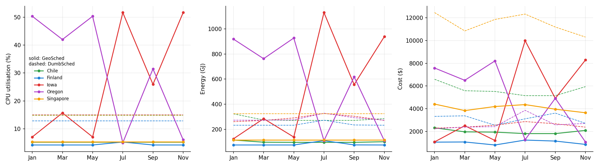

# GeoSched: Cutting Cloud Costs Across Data Centers

Code, results and an interactive explainer for **[Reducing Cloud Workload Costs in Geographically Distributed Data Centers with GeoSched](https://ieeexplore.ieee.org/document/10307394)** by Vishnuvajjhula Pranav Sai and Harsh Raj (IEEE, 2023).

**Interactive explainer:** https://harsh-github007.github.io/GeoSched/
**Preprint:** [`paper/preprint.pdf`](paper/preprint.pdf). The published version is on [IEEE Xplore](https://ieeexplore.ieee.org/document/10307394).

## The idea

**The problem:**
- Cloud providers run data centers around the world, and each one pays its local electricity price.
- Each one also pays to cool its servers. Cooling can take up to half of a data center's energy.
- Cooling costs depend on the weather. Below about 65°F a site can cool with outside air, which adds 5–17% to its power use. Above that it needs chillers, which add about a third.

**What GeoSched does:** it is a meta-scheduler that places every incoming job across five data centers.
- It prices the job at each site: the job's power, plus that site's cooling, times its run time, times the local electricity price.
- Batch jobs (scheduling classes 0–1) go to the cheapest site that has room for them.
- Latency-sensitive jobs (classes 2–3) stay at the site they arrived at.

**The paper's result:** compared with running every job locally ("DumbSched"), GeoSched cut operating cost by **11.7%** and energy by **8.2%**, about $4.8 million a year when extrapolated.

## The model

| | Equation |
| --- | --- |
| Total energy | E_total = E_server + E_cooling |
| Core power | P_core(u) = P_static + P_dynamic,peak · u |
| Job power and energy | P_j = c · P_core(u), E_j = P_j · t |
| Chiller (CRAC) cooling | P_CRAC = P_dc / COP, COP = 0.0068·T² + 0.0008·T + 0.458 (T = supply air, °C) |
| Outside-air cooling | P_air = (PUE − 1) · P_dc, PUE from 1.05 (below 25°F) to 1.17 (60–65°F) |
| Placement | Cost(j, dc) = T_j · P_total(j, dc) · C_MWh(dc); send j to the dc with the lowest cost |

Sites and traces (as in the paper): Council Bluffs, Iowa (trace A); The Dalles, Oregon (B); Singapore (C); Quilicura, Chile (D); Hamina, Finland (E). Each site has the same 12,584 machines as the Google cluster.

## Re-run

The simulation follows the paper:
- Six runs of five days, starting on the 15th of January, March, May, July, September and November 2013.
- Sites share how busy they are every five minutes.
- Each site receives its own five-day job trace.

Results on synthetic traces are in [`results/synthetic.md`](results/synthetic.md):

| | Energy (GJ) | Cost ($) |
| --- | ---: | ---: |
| DumbSched | 8,504.7 | 153,054 |
| GeoSched | 8,384.5 | 100,279 |
| Saving | 1.4% | 34.5% |



**What the re-run shows:**
- **Agreement with the paper:** GeoSched lowers cost in every month. Singapore, the most expensive site all year, keeps only its latency-sensitive jobs. Energy can rise at the site that receives more work, as the paper notes.
- **Larger saving than the paper's:** here every batch job may move, and weekly prices barely change within a five-day run. So GeoSched sends nearly all batch work to the one cheapest site: Oregon in winter and spring, Iowa in summer and autumn. The paper's own runs moved less work (its Fig. 6).
- **Smaller energy saving:** energy falls 1.4% in total. It rises slightly in July and September, when the cheapest site (Iowa) is warm enough to need chillers.

The re-run on Google's real cluster trace goes in `results/google.md` when it has been run (see below).

## Data

| File | Source |
| --- | --- |
| [`data/weekly_temp_f.csv`](data/weekly_temp_f.csv) | Weekly average temperature in 2013 for each site, read from the vector data of the paper's Fig. 3 |
| [`data/weekly_price_usd_mwh.csv`](data/weekly_price_usd_mwh.csv) | Weekly average electricity price in 2013, read from the paper's Fig. 4 |
| [`data/nodes.csv`](data/nodes.csv), [`data/pue.csv`](data/pue.csv) | Tables IV and V |
| [`data/trace_stats.csv`](data/trace_stats.csv) | Table II and Fig. 2: CPU, memory, run time and share of jobs by trace and scheduling class |

Iowa's price needs a note. In the paper's Fig. 4, Iowa's price line matches Iowa's temperature line in 51 of 53 weeks, so it looks like the temperature series was plotted by mistake. The simulator therefore uses the 2013 average price in MISO's West region, $31.81/MWh ([Potomac Economics, 2013 State of the Market Report](https://potomaceconomics.com/wp-content/uploads/2017/02/2013-State-of-the-Market-Report.pdf)). The series as plotted is kept in the `Iowa_as_plotted` column and can be used with `Params(iowa_price="Iowa_as_plotted")`.

**Settings the paper doesn't print.** These are assumptions, and all of them can be changed in `Params`:
- **Power:** 6.25 W idle and 12.5 W peak dynamic per core.
- **Cores:** 64 per unit of normalised CPU, as the paper says.
- **Cooling:** 20°C chiller supply air.
- **Utilisation:** job CPU utilisation drawn with a mean of 22%.

## Traces

**Real (Google, 2011):** this builds five traces of five days from [Google's cluster trace](https://github.com/google/cluster-data/blob/master/ClusterData2011_2.md), as in the paper. It downloads about 3 GB and caches the files in `traces/raw/`.

```bash
python scripts/build_google_traces.py
python experiments/run.py google
python experiments/analyze.py google
```

**Synthetic:** jobs generated to match the paper's per-class statistics (Table II), class mix (Fig. 2) and hourly arrival pattern of 400–700 jobs an hour with bursts (Fig. 1). Table II gives CPU per task. The number of tasks per job is heavy-tailed, with its mean set so that running every job locally keeps each site about 15% busy, as in the paper's Fig. 6.

```bash
python scripts/make_synthetic_traces.py
python experiments/run.py
python experiments/analyze.py
```

## Code

| Path | What it is |
| --- | --- |
| [`geosched/model.py`](geosched/model.py) | Power, cooling (COP, PUE) and cost model; site profiles |
| [`geosched/sim.py`](geosched/sim.py) | GeoSim: event-driven simulation of five sites, with GeoSched and DumbSched |
| [`geosched/traces.py`](geosched/traces.py) | The paper's trace format (Table I), reader and synthetic generator |
| [`scripts/`](scripts/) | Build the Google and synthetic traces |
| [`experiments/`](experiments/) | Run the six months and make the tables and charts |
| [`index.html`](index.html), [`assets/`](assets/) | The interactive explainer, with the cost model in JavaScript |

```bash
pip install numpy matplotlib pytest
pytest tests          # model and simulator tests
npm test              # the explainer's JavaScript model
```

The paper cites its original GeoSim source at bitbucket.org/anirudhnair/geosched, which is no longer online. The simulator here was written again from the paper's equations and tables.
